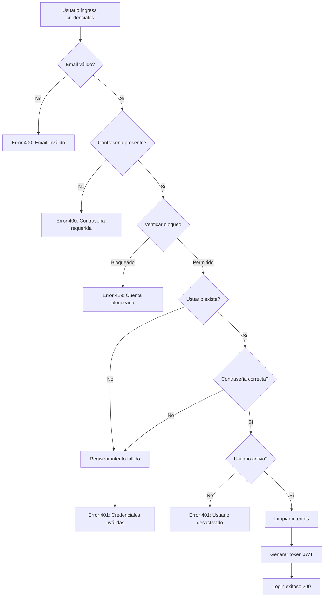

# Validaciones de Seguridad del Login

## ✅ Validaciones Implementadas

### 1. **Validación de Formato de Email**
- Email requerido y no vacío
- Formato válido según RFC 5322
- Máximo 255 caracteres
- Se normaliza a minúsculas

**Regex usado:**
```
/^[a-zA-Z0-9][a-zA-Z0-9._-]*@[a-zA-Z0-9][a-zA-Z0-9.-]*\.[a-zA-Z]{2,}$/
```

### 2. **Validación de Contraseña Fuerte (Registro)**
- **Longitud mínima:** 8 caracteres
- **Longitud máxima:** 128 caracteres
- **Complejidad requerida (al menos 3 de 4):**
  - ✓ Letras mayúsculas (A-Z)
  - ✓ Letras minúsculas (a-z)
  - ✓ Números (0-9)
  - ✓ Caracteres especiales (!@#$%^&*(),.?":{}|<>)
- **Contraseñas prohibidas:** password, 12345678, qwerty, admin, letmein, welcome

**Ejemplos válidos:**
- `MyPass123!`
- `Secure@2024`
- `Admin#Strong1`

**Ejemplos inválidos:**
- `password` (demasiado común)
- `1234` (muy corta)
- `abc` (sin complejidad)

### 3. **Bloqueo por Intentos Fallidos**

**Configuración:**
- **Máximo de intentos:** 5 intentos fallidos
- **Duración del bloqueo:** 15 minutos
- **Reset automático:** Después de 60 minutos sin actividad

**Funcionamiento:**
1. Cada login fallido incrementa el contador
2. Al llegar a 5 intentos, la cuenta se bloquea por 15 minutos
3. Durante el bloqueo, muestra tiempo restante
4. Tras login exitoso, se limpian todos los intentos

**Mensajes:**
```
"Demasiados intentos fallidos. Cuenta bloqueada por 15 minutos."
"Cuenta bloqueada temporalmente. Intente nuevamente en X minuto(s)."
```

### 4. **Rate Limiting por IP**

**Características:**
- Tracking por combinación de email + IP
- Protección contra ataques de fuerza bruta distribuidos
- Detección de IPs detrás de proxies/balanceadores
- Limpieza automática de registros antiguos (24 horas)

**Headers detectados:**
- `x-forwarded-for`
- `x-real-ip`
- IP de conexión directa

### 5. **Auditoría de Intentos**

**Eventos registrados:**
- ✅ Login exitoso
- ❌ Login fallido por contraseña incorrecta
- ❌ Login fallido por usuario no encontrado
- 🚫 Intento bloqueado por rate limiting
- 📊 IP, user-agent, timestamp

**Severidades:**
- `INFO`: Login exitoso
- `WARNING`: Login fallido
- `CRITICAL`: Cuenta bloqueada

## 📊 Modelo de Datos

### LoginAttempt Schema
```typescript
{
  email: string,           // Email normalizado
  ipAddress: string,       // IP del cliente
  attempts: number,        // Contador de intentos
  lastAttempt: Date,       // Último intento
  blockedUntil?: Date,     // Fecha de desbloqueo
  isBlocked: boolean       // Estado de bloqueo
}
```

**Índices:**
- Compuesto: `{ email: 1, ipAddress: 1 }` (único)
- TTL: Elimina registros después de 24 horas

## 🔒 Respuestas de la API

### Login Exitoso (200)
```json
{
  "success": true,
  "data": {
    "user": { ... },
    "accessToken": "eyJhbGci..."
  }
}
```

### Email Inválido (400)
```json
{
  "success": false,
  "message": "Formato de email inválido"
}
```

### Credenciales Incorrectas (401)
```json
{
  "success": false,
  "message": "Credenciales inválidas"
}
```

### Cuenta Bloqueada (429)
```json
{
  "success": false,
  "message": "Demasiados intentos fallidos. Cuenta bloqueada por 15 minutos.",
  "blockedUntil": "2026-02-15T00:15:00.000Z"
}
```

## 🚀 Deployment

### Variables de Entorno (Opcionales)
```env
# Configuración de seguridad del login
MAX_LOGIN_ATTEMPTS=5
BLOCK_DURATION_MINUTES=15
RESET_ATTEMPTS_MINUTES=60
```

### Base de Datos
- ✅ Modelo `LoginAttempt` se crea automáticamente
- ✅ Índices se crean en el primer arranque
- ✅ TTL automático limpia registros viejos

## 📝 Uso del Servicio

```typescript
import { LoginSecurityService } from './services/loginSecurity.service';

// Validar email
const emailCheck = LoginSecurityService.validateEmail(email);
if (!emailCheck.valid) {
  return res.status(400).json({ message: emailCheck.message });
}

// Validar contraseña (en registro)
const passCheck = LoginSecurityService.validatePassword(password);
if (!passCheck.valid) {
  return res.status(400).json({ message: passCheck.message });
}

// Verificar si puede intentar login
const securityCheck = await LoginSecurityService.canAttemptLogin(email, ip);
if (!securityCheck.allowed) {
  return res.status(429).json({ message: securityCheck.message });
}

// Registrar fallo
await LoginSecurityService.recordFailedAttempt(email, ip);

// Limpiar intentos (login exitoso)
await LoginSecurityService.clearAttempts(email, ip);
```

## ✨ Beneficios de Seguridad

1. **Protección contra Fuerza Bruta:** Bloqueo temporal tras múltiples intentos
2. **Validación de Datos:** Email y contraseña validados estrictamente
3. **Rate Limiting:** Protección por IP contra ataques distribuidos
4. **Contraseñas Robustas:** Requisitos de complejidad en el registro
5. **Auditoría Completa:** Todos los intentos quedan registrados
6. **Auto-limpieza:** Registros antiguos se eliminan automáticamente

## 🔄 Flujo de Login Seguro



## 🧪 Testing

### Casos de Prueba

1. **Email inválido:**
   - `test@` → Error
   - `@domain.com` → Error
   - `test.user@domain.co` → OK

2. **Contraseña débil:**
   - `abc` → Error (muy corta)
   - `password` → Error (común)
   - `MySecure123!` → OK

3. **Bloqueo por intentos:**
   - 5 intentos fallidos → Bloqueado 15 min
   - Esperar 15 min → Desbloqueado
   - Login exitoso → Contador reseteado

4. **Rate limiting:**
   - Misma IP, diferentes emails → Bloqueado por IP
   - Diferentes IPs, mismo email → Solo bloqueo por email

## 📚 Referencias

- RFC 5322: Email Address Format
- OWASP: Authentication Best Practices
- NIST: Password Guidelines
